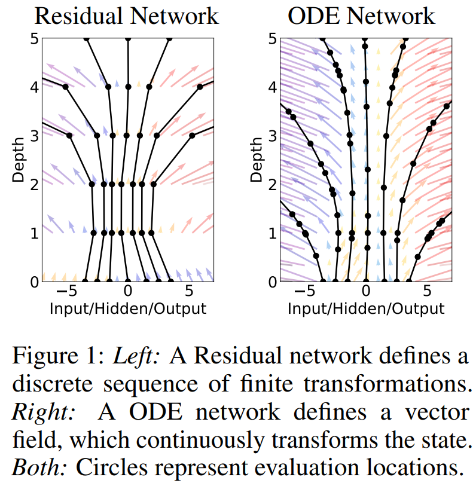

# Neural ODE

Paper: [Neural Ordinary Differential Equations][1]

Models such as residual networks, recurrent neural
network decoders, and normalizing flows build complicated transformations by composing a sequence of
transformations to a hidden state:
$$\textbf{h}_{t+1} = \textbf{h}_{t} + f(\textbf{h}_t, \theta_{t})$$
This can be seen as Euler discretization with step size $\Delta = 1$:
$$ \frac{\textbf{h}_{t+1} -\textbf{h}_{t}}{\Delta} = f(\textbf{h}_t, \theta_{t})$$ 

What happens as we add more layers and take smaller
steps? In the limit, we parameterize the continuous
dynamics of hidden units using an ordinary differential equation (ODE) specified by a neural network:

$$\frac{d\textbf{h}(t)}{dt} = f(\textbf{h}(t), t, \theta) $$

Starting from the input layer $\textbf{h}(0)$, we can define the output layer $\textbf{h}(T)$ to be the solution to this
ODE initial value problem at some time $T$.
This value can be computed by a black-box differential
equation solver, which evaluates the hidden unit dynamics f wherever necessary to determine the
solution with the desired accuracy

Advantages of Neural ODE: 
- Memory efficency - It is possible to compute gradients of a scalar-valued loss with respect to all inputs of any ODE solver, without backpropagating through the operations of the solver. So, the stroring of itermidiate representation in the forward pass is not needed.
- Adaptive computation - The ability to trade-off between quality and speed thanks to modern ODE solvers  

 The following section is the reminder of Recurrent Neural Network (RNN) [1]

## RNN
Paper: [Recurrent Neural Networks (RNNs):
A gentle Introduction and Overview][2]

Let's denote the hidden state and the input
at time step *t* respectively as $H_t \in \mathbb{R}^{n \times h}$ and $X_t \in \mathbb{R}^{n \times d}$ where *n* is the number of samples, *d* is the number of inputs of each sample and *h* is the number of hidden units. 
Let $h_t \in \mathbb{R}^d$ be the hidden state and $x_t$ the current input, then an RNN can be represented as 
$$h_t = f_{\theta}(h_{t-1}, x_t)$$ 
 Further, we use a weight matrix $W_{xh} \in \mathbb{R}^{d \times h}$,hidden-state-to-hidden-state matrix $W_{hh} \in \mathbb{R}^{h \times h}
$ and a bias parameter $b_h \in \mathbb{R}^{1 \times h}$.
Lastly, all this information is passed to an activation function $\phi$.

## Neural CDE 

Neural controlled differential equations (CDEs) are the continuous-time analogue to recurrent
neural networks (RNNs) and provide a natural method for
modelling temporal dynamics with neural networks.
Neural Rough Differential Equations for Long Time Series [1].  

> **Definition (CDE)**:   
> $~~~~$ Let $a, b  \in \mathbb{R}$ with $a <b$   
> $~~~~$ $X: [a, b] \rightarrow \mathbb{R}^v$ - a differentiable function   
> $~~~~$ $f: \mathbb{R}^w \rightarrow  \mathbb{R}^{w \times v}$ - a continuous function  
> Then $Z: [a, b] \rightarrow \mathbb{R}^w$ is defined as the unique solution to the *controlled differential equation*:   
> $$ 
\begin{equation}
\begin{cases}
Z_t = Z_a + \int_{a}^{t} f(Z_s) \dot{X_s}ds ~~~~ \forall t \in (a, b] \\
Z_a = \xi  \in \mathbb{R}^{w}
\end{cases}
\end{equation}
$$

Using $\dot{X_s}$ causes the solution to depend continuously on the evolution of $X$. We say that
the solution is *driven by the control X*.

Let's consider a time series $x$ as a collection of points $x_i \in \mathbb{R}^{v-1}$ with correpsponding timestamps $t_i \in \mathbb{R}$
$$x = ((t_0, x_0), (t_1, x_1), \dots, (t_n, x_n)), ~~~~ t_0 < \dots < t_n$$   

> **Definition (Neural CDE)**:   
> $~~~~$ $X: [t_0, t_n] \rightarrow \mathbb{R}^v$ - a differentiable interpolation of data: $X_{t_i} = (t_i, x_i)$   
> $~~~~$ $f_{\theta}: \mathbb{R}^w \rightarrow  \mathbb{R}^{w \times v}$ - a neural network   
> $~~~~$ $l_{\theta}: \mathbb{R}^w \rightarrow  \mathbb{R}^{q}$ - a linear map  
> Then $Z: [t_0, t_n] \rightarrow \mathbb{R}^w$ is defined as the hidden state and $Y := l_{\theta}(Z)$  as the output of *Neural CDE*:   
> $$ 
\begin{equation}
\begin{cases}
Z_t = Z_{t_0} + \int_{t_0}^{t} f_{\theta}(Z_s) \dot{X_s}ds ~~~~ \forall t \in (t_0, t_n] \\
Z_{t_0} = \xi_{\theta}(t_0, x_0)  \in \mathbb{R}^{w} \\
Y_{t} = l_{\theta} (Z_t)
\end{cases}
\end{equation}
$$

That is – just like an RNN – we have an evolving hidden
state *Z*, which is fed into a linear map to produce an output
*Y*

[1]: https://arxiv.org/abs/1806.07366
[2]: https://arxiv.org/pdf/1912.05911